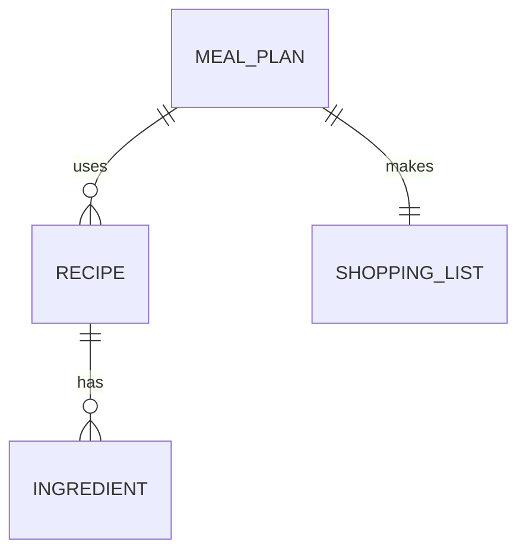

# Data model


```mermaid
erDiagram
  RECIPE ||--o{ INGREDIENT : has
  MEAL_PLAN ||--o{ RECIPE : uses
  MEAL_PLAN ||--|| SHOPPING_LIST : makes
```

```ts
type Ingredient = { name: string; amount: number; unit: 'g' | 'ml' | 'pcs' };
```
